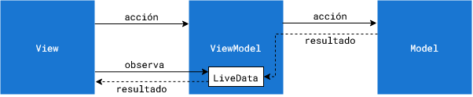

## Programación de aula

- Enero
  - Semana 9-13 - Java
    - [MVVM](#MVVM)
  - Semana 16-20
    - [API Retrofit](#api-retrofit)
  - Semana 23-27
    - [Retrofit y ListView](#retrofit-y-listview)
- Febrero
  - Semana 30-3
    - Acceso API
  - Semana 6-10
    - [Autentificación](https://www.youtube.com/watch?v=by-pChg9_A4)
  - Semana 13-17
    - Autentificación. Shared preferences
    - Modificación de información
  - Semana 20-24
    - Ejercicios de repaso

## MVVM

Separación de lógica de presentación y lógica de aplicación. No todo el código está en la Activity principal.

- UI: Eventos y mostrar datos
- ModelView: Enlaza la UI con el modelo.
- Model: Datos y transformaciones

[Vídeo](https://www.youtube.com/watch?v=-xTqfilaYow&ab_channel=PhilippLackner)

**LiveData y MutableLiveData**

Extraído de la documentación de Android:

LiveData es una clase de contenedor de datos observables. A diferencia de un observable regular, LiveData está optimizado para ciclos de vida, lo que significa que respeta el ciclo de vida de otros componentes de las apps, como actividades, fragmentos o servicios. Esta optimización garantiza que LiveData solo actualice observadores de componentes de apps que tienen un estado de ciclo de vida activo.

LiveData considera que un observador, que está representado por la clase Observer, está en estado activo si su ciclo de vida está en el estado STARTED o RESUMED. LiveData solo notifica a los observadores activos sobre las actualizaciones. Los observadores inactivos registrados para ver objetos LiveData no reciben notificaciones sobre los cambios.

Hablar del ejercicio de número aleatorio

- Modelo número aleatorio
- ModelView expone los datos aleatorios del modelo
- View observa los cambios

Reto para clase:

Siguiendo este esquema MVVM. Realiza una aplicación para buscar números primos aleatorios entre dos números dados por el usuario. Para no complicar la lógica el usuario introducirá los números bien (primero menor que el segundo y ambos positivos). Por ejemplo el usuario pide un número primo entre 1000 y 2000, la aplicación generará números aleatorios entre 1000 y 2000 hasta que encuentre un número primo, entonces parará.

### Seguir ejemplo

NOTA: Ignorar Fragments
Ejemplo más complejo [MVVM](https://gerardfp.github.io/dam/m8/uf1/mvvm/)

### Ejercicio

Utilizando los ejemplos anteriores crea una aplicación que pida dos números y tenga un radio con 4 operaciones.

Tendrá un botón calcular que utilizará un ViewModel y un Model para realizar el cálculo.

Los cálculos tardan un tiempo aleatorio en realizarse, mientras se espera el cálculo se reportará un mensaje "Esperando al servicio de cálculo"

## API Retrofit

- Generar una API con [FastAPI](https://fastapi.tiangolo.com/tutorial/)
- Consumir API con [RetroFit](https://square.github.io/retrofit/)
- [Ejemplo de GPT](./gpt-explicaciones/FastAPI%20math%20operations%20API.pdf)

Realizar un API de operaciones básicas de matemáticas que se calculen en el servicio que hemos creado con FastAPI.

Siguiente clase: Juntar Retrofit con MVVM

Investigación avanzada:
- [ORM](https://docs.ponyorm.org/firststeps.html)
- [Pony-FastAPI](https://docs.ponyorm.org/integration_with_fastapi.html)

## Retrofit y ListView

[https://learntodroid.com/consuming-a-rest-api-using-retrofit2-with-the-mvvm-pattern-in-android/](https://learntodroid.com/consuming-a-rest-api-using-retrofit2-with-the-mvvm-pattern-in-android/)

Ejercicio:

Busca un API pública, que no requiera autentificación o al menos tenga una parte que no la requiera. Realiza una tarea similar a la del ejemplo con esa API.

Ejemplo: [Rick and Morty](https://rickandmortyapi.com/)
